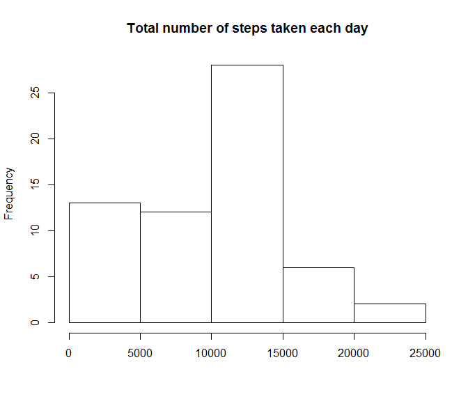
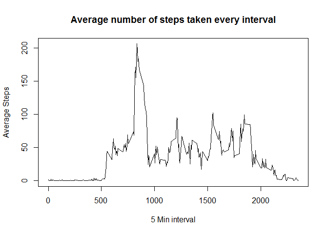
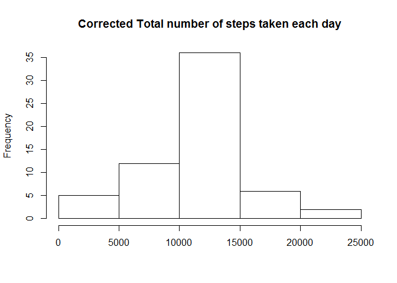

# Reproducible Research: Peer Assessment 1


## Loading librairies


```r
suppressMessages(library(dplyr))
suppressMessages(library(chron))
suppressMessages(library(lattice))
```

## Loading and preprocessing the data

* Assuming that data file ./activity/activity.csv is in the working directory if it's not the case use setwd
* Load File
* Cast date column to Date
* Rename date column to mesureDate


```r
originalData = read.csv("./activity/activity.csv")
originalData[,2] <-  as.Date(originalData[,2])
names(originalData)[2] <- "mesureDate"
```


## What is mean total number of steps taken per day?

(1) Calculate the total number of steps taken per day

* Group Data per day 
* Summarize Data


```r
tidyData1 <- group_by(originalData,mesureDate)
summaryData1 <- summarize(tidyData1, totalSteps = sum(steps, na.rm = TRUE))
```
(2) Make a histogram of the total number of steps taken each day

```r
hist(summaryData1$totalSteps, main="Total number of steps taken each day",xlab = "") 
```

<!-- -->

(3) Calculate and report the mean and median of the total number of steps taken per day


```r
print(paste("Mean : ",round(mean(summaryData1$totalSteps),2)))
```

```
## [1] "Mean :  9354.23"
```

```r
print(paste("Median : ",median(summaryData1$totalSteps)))
```

```
## [1] "Median :  10395"
```

## What is the average daily activity pattern?

(1) Make a time series plot (i.e. type = "l") of the 5-minute interval (x-axis) and the average number of steps taken, averaged across all days (y-axis)

* Summarize Data by interval


```r
tidyData2 <- group_by(originalData,interval)
summaryData2 <- summarize(tidyData2, meanSteps = mean(steps, na.rm = TRUE), sumSteps = sum(steps, na.rm = TRUE))
```

* Make a time series

```r
par(mfrow = c(1, 1))
plot(summaryData2$interval, summaryData2$meanSteps, type="l", xlab="5 Min interval", ylab="Average Steps",main = "Average number of steps taken every interval")
```

<!-- -->

(2) Identify Which 5-minute interval, on average across all the days in the dataset, contains the maximum number of steps


```r
maxSteps <- max(summaryData2$sumSteps)
InterValMaxSteps <- summaryData2[summaryData2$sumSteps  %in% c(maxSteps),1] 
print(paste("InterVal with Max Steps : ",InterValMaxSteps))
```

```
## [1] "InterVal with Max Steps :  835"
```


## Imputing missing values

(1) Calculate and report the total number of missing values in the dataset (i.e. the total number of rows with NAs)


```r
print(paste("Total Rows with NA Data : ",sum(is.na(originalData))))
```

```
## [1] "Total Rows with NA Data :  2304"
```

(2) Strategie to filling the missing Values :

* Reuse summaryData2 that contain Average Step to fill missing values

(3) Create a new dataset that is equal to the original dataset but with the missing data filled in  

* Create new column stepsCorrected that contain orginal steps when available and mean steps when NA
* Reshape tiddyData3 to select only mesureDate, interval, Steps corrected
* Summarize Data per date


```r
tidyData3 <- inner_join(originalData, summaryData2, by = "interval")
tidyData3 <- tidyData3 %>% mutate( stepsCorrected= ifelse(is.na(steps),round(meanSteps),steps)) %>% select(mesureDate, interval,stepsCorrected) %>% rename( steps=stepsCorrected)
tidyData3 <- group_by(tidyData3,mesureDate)
summaryData3 <- summarize(tidyData3, totalSteps = sum(steps, na.rm = TRUE))
```

(4) Make a histogram of the total number of steps taken each day and Calculate and report the mean and median total number of steps taken per day

* Make hitogram with Total number of steps taken each day


```r
hist(summaryData3$totalSteps, main="Corrected Total number of steps taken each day",xlab="") 
```

<!-- -->

* Display Mean and Median 

```r
print(paste("Mean : ",round(mean(summaryData3$totalSteps),2)))
```

```
## [1] "Mean :  10765.64"
```

```r
print(paste("Median : ",median(summaryData3$totalSteps)))
```

```
## [1] "Median :  10762"
```

You can see the difference between result of mean and median between two dataset with NA and without !!!!


## Are there differences in activity patterns between weekdays and weekends?

(1) Create a new factor variable in the dataset with two levels - "weekday" and "weekend" indicating whether a given date is a weekday or weekend day.


```r
daysTable <- summarise(tidyData3)
daysTable <- daysTable %>% mutate(weekDay = is.weekend(mesureDate)) %>% mutate(whichDay=ifelse(weekDay,"weekend","weekday")) %>% select(mesureDate,whichDay)
```


(2) Make a panel plot containing a time series plot (i.e. type = "l") of the 5-minute interval (x-axis) and the average number of steps taken, averaged across all weekday days or weekend days (y-axis)

* Summarize data with day and interval

```r
tidyData4 <- inner_join(tidyData3, daysTable, by = "mesureDate")
tidyData4 <- tidyData4 %>% group_by(interval,whichDay)
tidyData4 <- summarize(tidyData4, meanSteps = mean(steps))
```
* Make a Panel Plot


```r
par(mfrow = c(1, 1))
xyplot(meanSteps ~ interval | whichDay, data = tidyData4, layout = c(1, 2), type = "l", xlab = "Interval", ylab = "Number of steps")
```

<!-- -->
